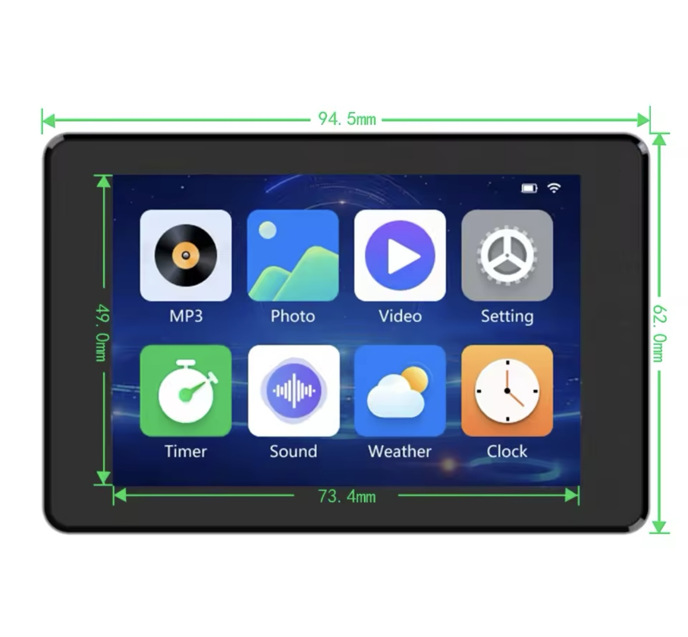
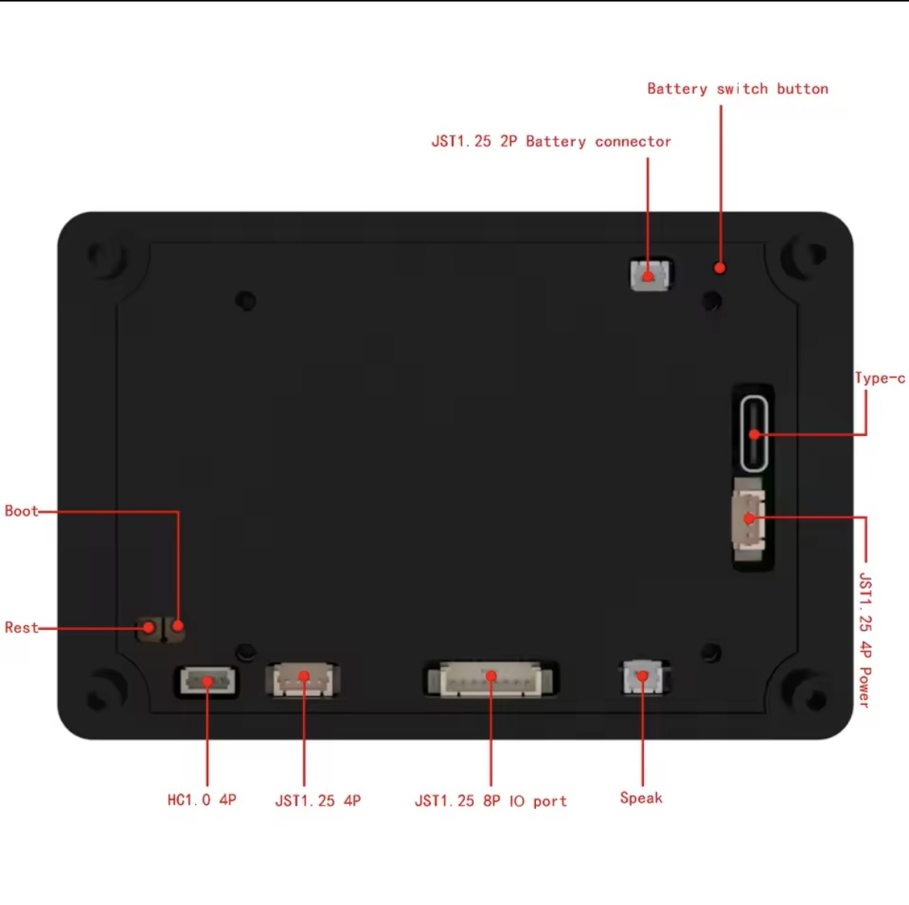

# JC3248W535 LVGL Application

Este é um projeto baseado em PlatformIO para o display JC3248W535 usando a biblioteca LVGL.

## Estrutura do Projeto

```
src/
├── main.c              # Arquivo principal da aplicação
├── main.h              # Header principal
├── lv_conf.h           # Configuração do LVGL
├── interface/          # Módulo de interface do usuário
│   ├── ui_main.c       # Interface principal (botão simples)
│   └── ui_main.h
├── sensors/            # Módulo de sensores
│   ├── sensors.c       # Implementação dos sensores
│   └── sensors.h
└── utils/              # Utilitários diversos
    └── utils.h
```

## Funcionalidades

- Interface simples com botão interativo
- Estrutura modular para fácil expansão
- Suporte para sensores (base implementada)
- Display 320x480 com rotação de 90°

## Como usar

1. Abra o projeto no VS Code com PlatformIO
2. Compile com `pio run`
3. Faça upload com `pio run --target upload`



I had downloaded the zip file from the manufacturer, but had a really hard time getting it to build in VSCode/PlatformIO so I thought I would share my build to help others get started with the board.

Under the covers, this build leverages ESP-IDF 5.3 and LVGL 8.3.  I found that it would not build on Arduino ESP32, as the display code required ESP-IDF (5.3.0) in order to complile.  And Arduino ESP32 is currently ESP-IDF 4.x



For this board from https://s.click.aliexpress.com/e/_DFO5uIV